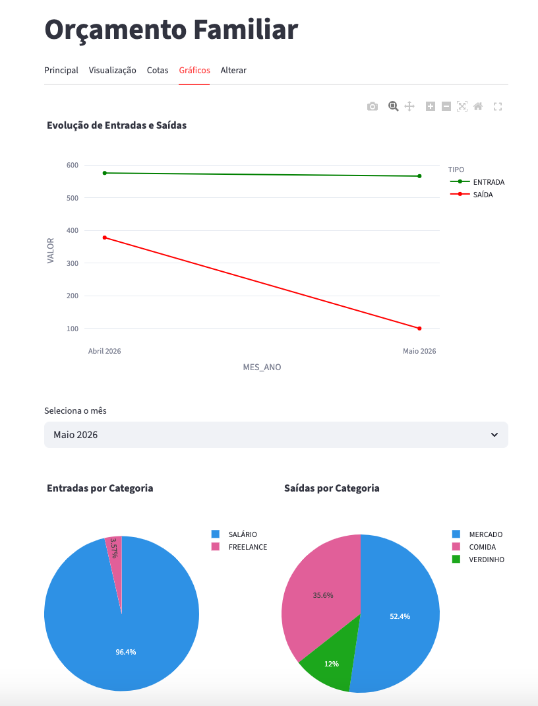
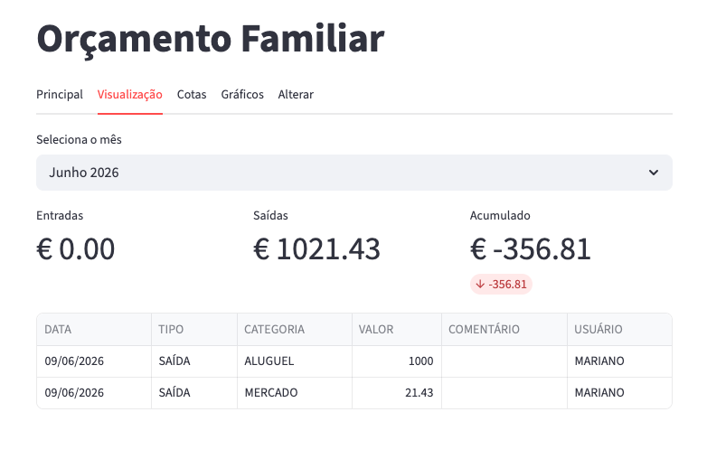
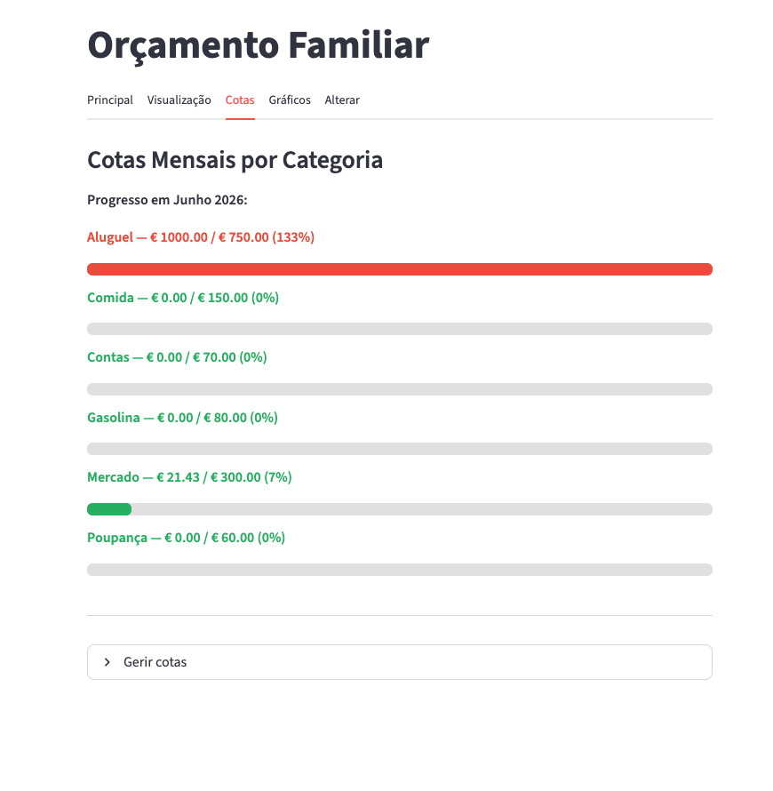

# Gestor Financeiro Familiar

App web para controlo de finanças pessoais com integração ao Google Sheets.

## Funcionalidades
- Registro de entradas e saídas por categoria e utilizador.
- Filtro por mês com totais de saldo e exibição dos registros mensais.
- Gráficos de evolução anual, gráfico de pizza para distribuição mensal por categoria.
- Registro de cotas para controle financeiro.

## Tecnologias
Python · Streamlit · Pandas · Plotly · Google Sheets API

## Como executar
```bash
pip install -r requirements.txt
streamlit run app.py
```

> Requer ficheiro de credenciais Google (`gcp_service_account`) e variáveis em `.streamlit/secrets.toml`.




